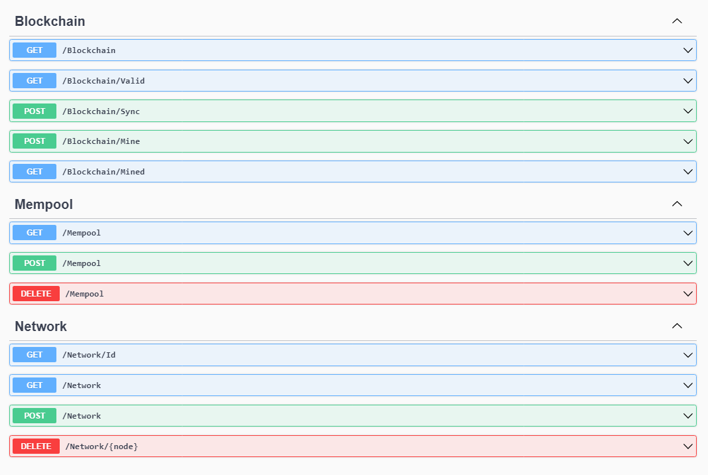

# Cambriano

Cambriano apresenta os mecanismos básicos de uma blockchain. O projeto tem a finalidade de experimentar a ideia por trás da mais promissora e disruptiva tecnologia desde o advento da Internet.

O nome Cambriano faz referência a um ponto importante na história da vida na Terra. Foi nesse período que ocorreu a *explosão cambriana*, evento em que a maioria dos grupos principais de animais apareceram no registro fóssil. Do mesmo modo, a tecnologia Blockchain está marcando a nossa história e promovendo uma explosão de projetos inovadores em diversas áreas.

## Projeto

Cambriano foi desenvolvido em C# para o [.Net 5](https://dotnet.microsoft.com/download/dotnet/5.0). Portanto, o [Visual Studio](https://visualstudio.microsoft.com/pt-br/) 2019 satisfaz os requisitos mínimos necessários para compilar e executar o projeto.  Para fins didáticos, a aplicação foi automatizada o mínimo possível e as operações do nodo são acessíveis manualmente através da interface do Swagger.



## Ponto de partida

Monte uma ou mais redes, interconectadas ou não, crie transações em diferentes nodos, minere blocos, sincronize as blockchains e observe o comportamento do mecanismo de consenso e das políticas do mempool. Os tópicos I e II auxiliam no início desse processo.

## I. Como criar e acessar um nodo

Abra o terminal, entre no diretório *src/Jitsukawa.Cambriano* e execute o comando a seguir, informando a porta desejada. 

```xml
dotnet run --urls=http://localhost:<porta>
```

Depois de criado, o nodo pode ser acessado pelo navegador no endereço indicado abaixo. A porta deve ser a mesma utilizada no comando anterior.

```xml
http://localhost:<porta>/swagger/index.html
```

Exemplos:
|*Criação do nodo*|*Acesso ao nodo criado*|
|--|--|
|dotnet run --urls=http://localhost:5000|http://localhost:5000/swagger/index.html|
|dotnet run --urls=http://localhost:5001|http://localhost:5001/swagger/index.html|
|dotnet run --urls=http://localhost:5002|http://localhost:5002/swagger/index.html|

Importante:

- O acesso ao nodo também pode ser feito por um cliente HTTP como o Curl ou o Postman.

- O arquivo *appsettings.json* do projeto contém os parâmetros de configuração do Mempool:

    - *BlockSize* - tamanho do bloco em quantidade de transações.

    - *TransactionLifeTime* - prazo, em minutos, para que uma transação seja confirmada na rede.

## II. Como montar uma rede

1. Crie mais de um nodo com as instruções apresentadas no tópico anterior. Não esqueça de que cada um deve ficar em uma porta diferente.

2. Acesse a operação POST /Network de cada nodo e envie em *body* uma lista *json* com os endereços dos demais nodos.

3. Confirme a conexão de cada nodo com seus vizinhos através da operação GET /Network.

Exemplo de rede com 3 nodos:

|*Endereço do nodo*|*Conteúdo json do body de POST /Network*|
|--|--|
|http://localhost:5000|["http://localhost:5001","http://localhost:5002"]|
|http://localhost:5001|["http://localhost:5000","http://localhost:5002"]|
|http://localhost:5002|["http://localhost:5000","http://localhost:5001"]|

Importante:

- Apesar do exposto, não é necessário que cada nodo seja conectado a todos os outros de forma direta. O importante é que eles estejam ligados de maneira que o fluxo de dados alcance todos os participantes.

- Caso prefira criar sua rede em ambiente **Docker**, utilize os arquivos *Dockerfile* e *docker-compose.yml* presentes no diretório *src* do projeto. Eles foram preparados para instruir o Docker a compilar a aplicação e criar cada nodo em uma porta diferente (5000 a 5004).

## Contribuição

Gostou do projeto? Favorite clicando na estrela e considere fazer uma criptocontribuição abaixo. **:)**

|*Bitcoin*|*Ether*|
|:--|--:|
|`3Ki2BKFjS4MZHt5RfUHASa3ZjfgsvEYACm`|`0x205575000c9a46562c191A11bCFdcF8A3254f4B5`|
|||
